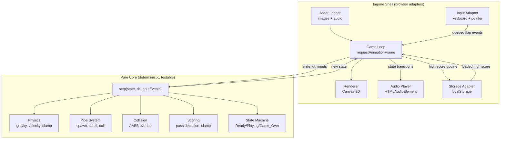
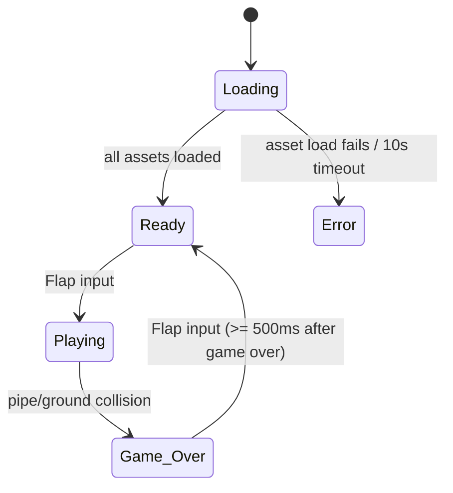
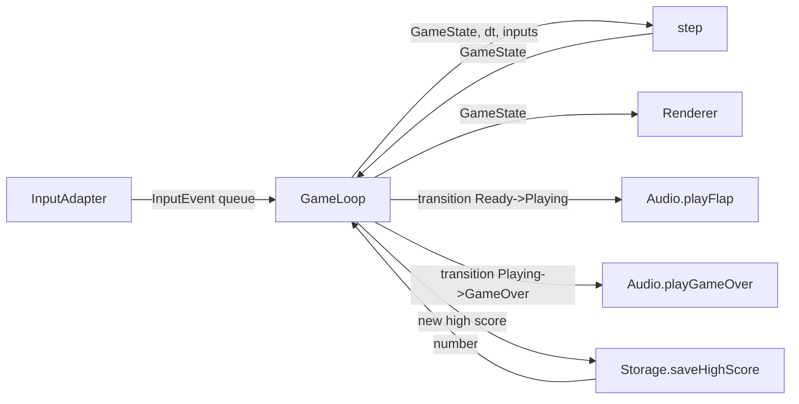

# Design Document

## Overview

Flappy Kiro is a client-side, browser-based endless side-scroller. There is no backend: all logic, rendering, audio, and persistence run in the browser. The player guides a ghost sprite through gaps in scrolling pipe pairs, earning a point per cleared pair, until the ghost collides with a pipe or the ground.

The design separates **pure game logic** (state, physics, collision, scoring, pipe lifecycle) from **impure adapters** (Canvas rendering, Web Audio, `localStorage`, DOM input, `requestAnimationFrame`). This separation is the central design decision: it keeps the simulation deterministic and testable (a step function `(state, dt, inputs) -> state`) while confining browser-specific side effects to thin, swappable adapters.

### Technology Choices and Rationale

| Concern | Choice | Rationale |
|---|---|---|
| Language | Vanilla ES modules (JavaScript) | No framework overhead for a single-canvas arcade game. Native ES modules load directly in modern browsers, keeping the stack minimal per the request. |
| Rendering | HTML5 Canvas 2D | Immediate-mode drawing at 60fps is the natural fit for sprite/shape rendering. WebGL is overkill for 2D retro visuals. |
| Audio | HTML5 `Audio` elements (with Web Audio fallback not required) | Two short one-shot sound effects only; `HTMLAudioElement` with `currentTime = 0` restart is sufficient and simple. |
| Persistence | `localStorage` | Requirement 8 explicitly mandates browser local storage for the high score. |
| Game loop | `requestAnimationFrame` | Browser-synced frame timing, automatic throttling on hidden tabs, and access to a high-resolution timestamp for fixed-timestep integration. |
| Build/tooling | None required to run; test runner + PBT library for tests | The game runs by opening `index.html`. A dev-only test setup is added for property-based testing. |

The physics simulation uses a **fixed-timestep accumulator** so behavior is deterministic and frame-rate independent, which is what makes the physics and collision properties well-defined for testing.

## Architecture

The application is organized into a pure core and an impure shell. The core never imports browser APIs; the shell wires adapters into the core each frame.



### Frame Cycle

Each animation frame the loop:

1. Computes elapsed real time and adds it to a time accumulator.
2. Drains queued input events (flaps) captured since the last frame.
3. Runs the pure `step` in fixed increments while the accumulator holds at least one fixed timestep, passing input on the first sub-step only.
4. Detects state transitions by comparing the previous and new `Game_State` and fires side effects (audio, high-score persistence) in the shell.
5. Renders the resulting state to the Canvas.

```mermaid
sequenceDiagram
    participant RAF as requestAnimationFrame
    participant Loop as Game Loop
    participant Core as step()
    participant FX as Adapters (Audio/Store/Render)

    RAF->>Loop: timestamp
    Loop->>Loop: accumulate dt, drain input queue
    loop while accumulator >= FIXED_DT
        Loop->>Core: step(state, FIXED_DT, inputs)
        Core-->>Loop: nextState
        Loop->>Loop: accumulator -= FIXED_DT
    end
    Loop->>FX: fire transition side effects (audio, persist)
    Loop->>FX: render(state)
    Loop->>RAF: schedule next frame
```

### State Machine



`Loading` and `Error` are shell-level presentation states around the core `Game_State` (`Ready`, `Playing`, `Game_Over`). The core simulation only runs once assets resolve; the shell renders the loading/error screens.

## Components and Interfaces

### Pure Core

**`step(state, dt, inputEvents) -> GameState`**
The single deterministic transition function. Given the current immutable game state, a fixed delta time in seconds, and the input events for this step, it returns the next state. All physics, pipe movement, spawning, collision, scoring, and state transitions happen here. It performs no I/O and reads no globals (randomness is supplied via the state's RNG — see Data Models).

```
step(state: GameState, dt: number, inputEvents: InputEvent[]): GameState
```

**Physics module**
- `applyGravity(velocityY, dt): number` — integrates gravity, capped at terminal velocity.
- `applyFlap(): number` — returns the fixed upward flap velocity (replaces prior velocity).
- `integratePosition(y, velocityY, dt): number` — advances position.
- `clampToTop(ghost): Ghost` — enforces the top boundary.

**Pipe system module**
- `advancePipes(pipes, dt, speed): Pipe_Pair[]` — moves all pairs left at the shared speed.
- `shouldSpawn(pipes, spawnSpacing, playAreaWidth): boolean` — true when the most recent pair has traveled the fixed spacing from its generation point.
- `spawnPipe(rng, playArea): Pipe_Pair` — creates a pair at the right edge with a randomized gap center and fixed gap height (see Data Models constraints).
- `cullOffscreen(pipes): Pipe_Pair[]` — removes pairs whose right edge has passed the left edge.

**Collision module**
- `aabbOverlap(a: Rect, b: Rect): boolean` — axis-aligned bounding box overlap (≥ 1px).
- `hitsAnyPipe(ghost, pipes): boolean`
- `hitsGround(ghost, playArea): boolean`

**Scoring module**
- `scorePasses(ghost, pipes, score): { score, pipes }` — increments once per pair when the ghost passes a pair's right edge, marking each pair counted; clamps at 999999.

**State machine module**
- `transition(state, event): GameState` — pure guarded transitions between `Ready`, `Playing`, `Game_Over`, including the 500ms restart guard.

### Impure Shell / Adapters

**Asset Loader** — Loads `assets/ghosty.png`, `assets/jump.wav`, `assets/game_over.wav`. Resolves when all load; rejects (or times out at 10s) so the shell can show the error screen. Reports per-asset failure so the ghost sprite can fall back to a placeholder and audio can degrade gracefully.

**Input Adapter** — Registers `keydown` (Spacebar) and `pointerdown` (click/tap within the Play_Area) listeners. Normalizes both into a queued `InputEvent { type: 'flap', timestamp }`. The queue is drained by the loop; the adapter never mutates game state directly.

**Renderer (`render(ctx, state, assets)`)** — Draws background, pipes, ghost (sprite or placeholder), score, and the state-appropriate overlay (Ready instruction, Game_Over panel with final score + high score + restart instruction). Maintains the 9:16 letterboxed canvas sizing on resize.

**Audio Player** — `playFlap()` and `playGameOver()`. Restarts a one-shot by setting `currentTime = 0` before `play()`. Silently no-ops if the corresponding asset failed to load.

**Storage Adapter** — `loadHighScore(): number` (returns 0 on missing/invalid/parse failure) and `saveHighScore(n): void` (swallows write failures so gameplay continues).

**Game Loop** — Owns the `requestAnimationFrame` cycle, the fixed-timestep accumulator, transition detection, and orchestration of adapters described in the Frame Cycle above.

### Interface Boundary Diagram



## Data Models

All core data is plain, immutable-by-convention JavaScript objects. Dimensions are expressed in Play_Area coordinate units (a fixed logical 9:16 space); the renderer scales logical units to device pixels.

### Constants

```
FIXED_DT           = 1 / 60 seconds
PLAY_AREA          = { width: 360, height: 640 }   // logical 9:16 units
GRAVITY            = constant downward acceleration (units/s^2)
FLAP_VELOCITY      = fixed upward speed in [300, 600] units/s   // e.g. 420
TERMINAL_VELOCITY  = fixed downward cap (units/s)
PIPE_SPEED         = fixed value in [100, 300] units/s          // e.g. 160
PIPE_SPACING       = fixed value in [150, 400] units            // e.g. 220
GAP_HEIGHT         = fixed value in [0.20, 0.35] * height AND >= 1.5 * ghost.height
GAP_CENTER_MIN     = 0.10 * height
GAP_CENTER_MAX     = 0.90 * height
GHOST_START        = { x: 0.25 * width, y: height / 2 }
SCORE_MAX          = 999999
RESTART_LOCKOUT_MS = 500
```

### GameState

```
GameState {
  mode: 'Ready' | 'Playing' | 'Game_Over'
  ghost: Ghost
  pipes: Pipe_Pair[]
  score: number                 // integer, 0..999999
  highScore: number             // integer, 0..999999
  distanceSinceLastSpawn: number
  timeInGameOver: number        // seconds accumulated in Game_Over (for restart lockout)
  rng: RngState                 // seedable PRNG state, threaded through step
}
```

### Ghost

```
Ghost {
  x: number          // fixed at GHOST_START.x
  y: number          // top of the ghost's bounding box
  width: number
  height: number
  velocityY: number  // units/s; positive is downward
}
```

The ghost's bounding box is `{ x, y, width, height }`, used directly for collision.

### Pipe_Pair

```
Pipe_Pair {
  id: number
  x: number            // left edge of the pipe columns; decreases over time
  width: number
  gapCenterY: number   // in [GAP_CENTER_MIN, GAP_CENTER_MAX]
  gapHeight: number    // = GAP_HEIGHT
  counted: boolean     // set true once this pair has awarded a point
}
```

Derived rectangles:
- Top pipe: `{ x, y: 0, width, height: gapCenterY - gapHeight/2 }`
- Bottom pipe: `{ x, y: gapCenterY + gapHeight/2, width, height: PLAY_AREA.height - (gapCenterY + gapHeight/2) }`

### InputEvent

```
InputEvent {
  type: 'flap'
  timestamp: number   // ms, from the input adapter
}
```

### RngState

A small seedable PRNG (e.g. mulberry32) whose state is carried in `GameState`. Threading randomness through state keeps `step` pure and makes pipe generation reproducible in tests, while production seeds from `Date.now()`.

### Persisted Model (localStorage)

Key: `flappy-kiro.highScore`. Value: the high score serialized as a decimal string. On load, a missing, non-numeric, negative, or unparseable value maps to `0` (Requirement 8.4).

Now I'll assess property-based testing applicability and run the prework analysis before writing the Correctness Properties section.

## Correctness Properties

*A property is a characteristic or behavior that should hold true across all valid executions of a system — essentially, a formal statement about what the system should do. Properties serve as the bridge between human-readable specifications and machine-verifiable correctness guarantees.*

These properties target the pure core (`step` and its modules) and the pure sizing/parsing helpers. Side-effecting concerns (audio, persistence I/O, sprite drawing, frame-rate) are covered by unit/integration tests in the Testing Strategy instead.

### Property 1: Ready state initial ghost placement

*For any* Play_Area dimensions, the initial ghost's horizontal position equals 25% of the Play_Area width and the ghost is centered vertically within the Play_Area.

**Validates: Requirements 1.2**

### Property 2: Ready state is inert

*For any* state whose mode is Ready and *for any* delta time, stepping the state without a flap leaves the ghost's vertical position and vertical velocity unchanged (no gravity applied).

**Validates: Requirements 1.4**

### Property 3: Flap sets a single fixed upward velocity

*For any* Playing state with any prior vertical velocity, applying a flap sets the ghost's vertical velocity to the single fixed upward flap velocity, independent of the prior velocity (replacement, not accumulation).

**Validates: Requirements 2.2**

### Property 4: Ghost never rises above the top boundary

*For any* Playing state and *for any* input, after stepping, the ghost's top edge remains at or below the top edge of the Play_Area.

**Validates: Requirements 2.6, 3.4**

### Property 5: Gravity increases downward velocity below terminal

*For any* Playing state whose downward velocity is below terminal velocity, stepping without a flap produces a strictly greater (more downward) vertical velocity.

**Validates: Requirements 3.1**

### Property 6: Downward velocity is capped at terminal velocity

*For any* Playing state and *for any* number of no-flap steps, the ghost's downward vertical velocity never exceeds the terminal velocity cap.

**Validates: Requirements 3.2**

### Property 7: Position integrates velocity

*For any* Playing state where boundary clamping does not engage, after stepping the ghost's vertical position equals its prior position plus velocity times delta time.

**Validates: Requirements 3.3**

### Property 8: Pipes scroll uniformly leftward

*For any* set of pipe pairs in a Playing state and *for any* delta time, after stepping every pipe pair's x-position decreases by exactly the shared pipe speed times delta time.

**Validates: Requirements 4.1**

### Property 9: Pipe spawn spacing is constant

*For any* Playing simulation, the horizontal distance between the generation points of consecutive pipe pairs equals the fixed pipe spacing.

**Validates: Requirements 4.2**

### Property 10: Generated gap center is within vertical bounds

*For any* RNG state, a generated pipe pair's gap center lies no closer than 10% of the Play_Area height to the top edge and no closer than 10% to the bottom edge.

**Validates: Requirements 4.3**

### Property 11: Generated gap is passable

*For any* generated pipe pair, the gap height falls within 20% to 35% of the Play_Area height and is at least 1.5 times the ghost height.

**Validates: Requirements 4.4**

### Property 12: Offscreen pipes are culled

*For any* set of pipe pairs, after stepping no pipe pair remains whose right edge has moved past the left edge of the Play_Area.

**Validates: Requirements 4.5**

### Property 13: Each pipe pair is scored at most once

*For any* Playing simulation in which the ghost passes a pipe pair's right edge without collision, the score increases by exactly 1 for that pair, and any subsequent pass of the same already-counted pair leaves the score unchanged.

**Validates: Requirements 5.1, 5.5**

### Property 14: Score stays within bounds and saturates

*For any* number of scoring events, the score remains within 0 to 999999 inclusive, and once it reaches 999999 it does not increase further.

**Validates: Requirements 5.4**

### Property 15: Any collision ends the game

*For any* Playing state in which the ghost's bounding box overlaps a pipe's bounding box by at least one pixel, or the ghost's bottom edge reaches or crosses the ground boundary, stepping transitions the mode to Game_Over.

**Validates: Requirements 6.1, 6.2**

### Property 16: Game_Over freezes the pipe field

*For any* Game_Over state, stepping does not add new pipe pairs and does not change any pipe pair's x-position.

**Validates: Requirements 6.5, 6.6**

### Property 17: Game_Over transition is idempotent

*For any* Game_Over state, stepping again does not re-trigger the Game_Over transition (no duplicate transition signal is produced).

**Validates: Requirements 6.7**

### Property 18: Flap during the restart lockout is a no-op

*For any* Game_Over state whose accumulated time in Game_Over is less than 500 milliseconds, applying a flap leaves the mode as Game_Over and leaves the ghost's position and velocity unchanged.

**Validates: Requirements 2.7, 7.5**

### Property 19: Flap after lockout restarts to Ready

*For any* Game_Over state whose accumulated time in Game_Over is at least 500 milliseconds, applying a flap resets the ghost to the starting position, sets the current score to 0, and sets the mode to Ready.

**Validates: Requirements 7.4**

### Property 20: High score is the running maximum

*For any* current score and stored high score, on the Game_Over transition the resulting high score equals the maximum of the current score and the prior high score.

**Validates: Requirements 8.1**

### Property 21: High score parsing is total and safe

*For any* stored string value, parsing the high score yields a non-negative integer: valid non-negative integer strings parse to their integer value, while missing, non-numeric, negative, or otherwise unparseable values yield 0.

**Validates: Requirements 8.4**

### Property 22: Canvas sizing preserves aspect ratio and fits the viewport

*For any* viewport width and height, the computed canvas dimensions maintain a 9:16 width-to-height ratio and fit entirely within the viewport, with neither dimension exceeding the viewport.

**Validates: Requirements 9.3**

## Error Handling

Errors are handled by degrading gracefully wherever gameplay can reasonably continue, and by surfacing a clear failure screen only when the game genuinely cannot start.

| Failure | Handling | Requirement |
|---|---|---|
| Required asset fails to load or exceeds 10s | Shell stays out of Ready and shows an error message; core simulation never starts. | 1.6 |
| Ghost sprite (`ghosty.png`) fails to load | Renderer draws a solid-colored placeholder of equivalent size; gameplay continues. | 9.5 |
| Sound asset fails to load or exceeds 5s | Audio player marks that sound unavailable; the corresponding `play*` call no-ops; input is never blocked. | 10.2 |
| Game-over sound cannot play | Game_Over transition completes without audio and the state remains Game_Over. | 6.4 |
| Pipe pair cannot be generated (Play_Area bounds unavailable) | Existing pipes are retained unchanged and an error indication is produced; the core does not spawn. | 4.6 |
| High score value in storage missing/invalid | Parser returns 0 (Property 21). | 8.4 |
| Writing high score to `localStorage` throws | Storage adapter catches the error; the in-session high score is retained and gameplay continues. | 8.5 |

Guarding principles:
- The core `step` is total: it never throws for any valid `GameState` and `dt >= 0`. Invalid external inputs are normalized at the adapter boundary before reaching the core.
- Adapter failures are converted into either a degraded-but-playable path or, only for start-blocking asset failures, the error screen.

## Testing Strategy

The core logic is pure and property-rich, so it is tested primarily with property-based tests; browser adapters and UI are tested with example-based unit tests, integration tests against mocked browser APIs, and a performance smoke test.

### Property-Based Testing

PBT applies to the pure core because `step` and its helpers are deterministic pure functions with universal invariants over large input spaces (velocities, positions, dimensions, RNG states, arbitrary stored strings).

- **Library:** [fast-check](https://github.com/dubzzz/fast-check) with a test runner such as Vitest or Jest. fast-check is the standard property-based testing library for JavaScript; we will not implement property testing from scratch.
- **Iterations:** each property test runs a minimum of 100 iterations.
- **Traceability:** each property test is tagged with a comment in the format **Feature: flappy-kiro, Property {number}: {property_text}** and implemented as a single property-based test.
- **Coverage:** Properties 1–22 above map one-to-one onto property tests. Generators produce arbitrary Play_Area dimensions, ghost states, velocities, delta times, pipe configurations, seeded RNG states, and arbitrary strings (for high-score parsing). Edge cases (empty pipe list, terminal velocity, exact boundary overlaps, whitespace/negative/huge score strings) are covered by the generators.

### Unit Tests (example-based)

Concrete examples and simple deterministic transitions:
- Initialization: mode Ready, score 0 on load (1.1, 1.5).
- Ready overlay names the flap input; Game_Over overlay shows high score and restart text (1.3, 7.2, 7.3).
- Ready → Playing on flap; Playing resets score to 0 (2.1, 5.3).
- Input adapter maps Spacebar and in-bounds pointer events to a queued flap event (2.4, 2.5).

### Integration Tests (mocked browser APIs)

Side-effecting behavior verified against mocks/spies, using 1–3 representative examples:
- Asset loader: failing/slow asset yields error state and blocks Ready (1.6); sprite-load failure yields placeholder (9.5); audio preload and failure handling (10.1, 10.2).
- Audio adapter: `playFlap` on flap (2.3), `playGameOver` on game over (6.3, 6.4), restart-from-start behavior via `currentTime = 0` (10.4), prompt playback (10.3, 10.5).
- Storage adapter: load on init (8.3), persist on high-score update (8.2), write-failure tolerated (8.5).
- Renderer: score display reflects state (5.2, 7.1), all pipes rendered while Playing/Game_Over (9.1, 9.4).
- Pipe generation error path when bounds are unavailable (4.6).

### Performance Smoke Test

A single measured run verifies the Playing loop sustains at least 55 fps against the 60 fps target (9.2). This is a smoke/performance check, not a property.

### Why not PBT everywhere

Audio playback, `localStorage` I/O, sprite drawing, asset-load timing, and frame-rate are side-effect or infrastructure concerns whose behavior does not vary meaningfully with generated input; running them 100+ times adds no coverage over 1–3 representative examples, so they use unit/integration/smoke tests instead.
